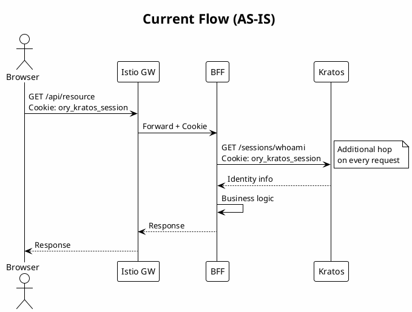
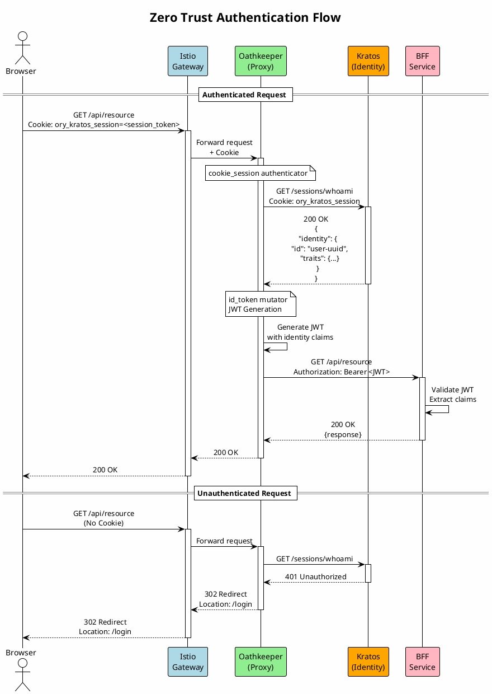
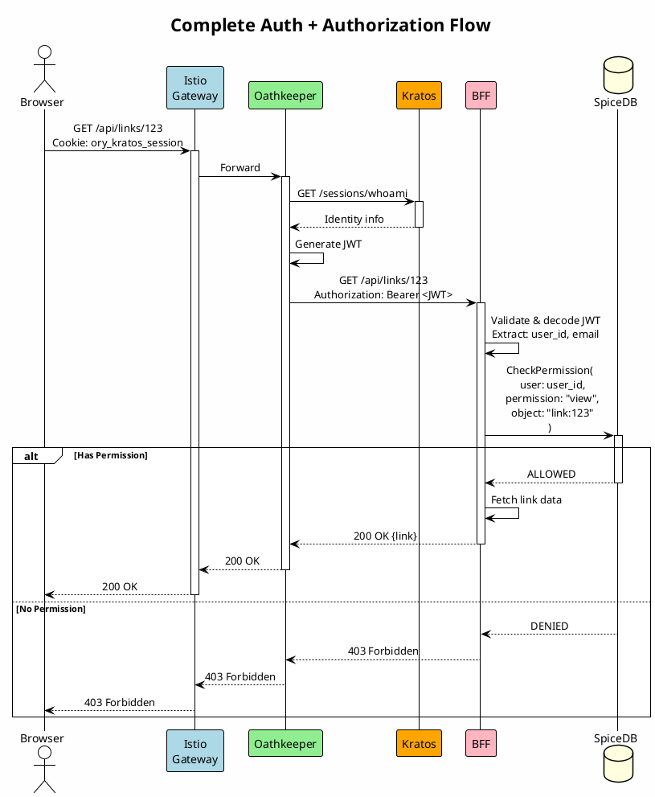

# 1. Zero Trust Authentication Flow: Browser → Istio → Oathkeeper → BFF

Date: 2026-01-26

## Status

Proposed

## Context

We need to implement a secure Zero Trust architectural pattern for authentication and authorization 
of requests from the browser to BFF (Backend for Frontend) services.

### Current State

Currently, BFF performs session validation with an additional request to Kratos `/sessions/whoami` on every incoming request.



### Current Problems

1. **Additional hop from BFF to Kratos** — every request requires a synchronous whoami call, increasing latency
2. **Duplicated session validation logic** — each BFF service implements its own middleware for validation
3. **Cookie-based sessions inside the cluster** — cookies are not suitable for service-to-service communication
4. **BFF coupled with Kratos** — business logic is mixed with authentication logic

### Requirements

- Centralized authentication check at the API Gateway level
- Transform cookie sessions into JWT tokens for internal services
- Support Istio Service Mesh for traffic management
- Integration with Ory Kratos for identity management

## Decision

We implement the following authentication flow:

```
Browser → Istio Gateway → Oathkeeper (cookie_session → Kratos whoami) → 
→ Oathkeeper (id_token mutator) → BFF (Authorization: Bearer <JWT>)
```

### Components

| Component | Role | Technology |
|-----------|------|------------|
| Browser | Client | Web Application |
| Istio Gateway | Ingress Load Balancer | Istio/Envoy |
| Oathkeeper | Identity & Access Proxy | Ory Oathkeeper |
| Kratos | Identity Server | Ory Kratos |
| BFF | Backend for Frontend | Go/Node.js |

### Sequence Diagram: Authentication Flow



### C4 Context Diagram: System Overview

```plantuml
@startuml
!include https://raw.githubusercontent.com/plantuml-stdlib/C4-PlantUML/master/C4_Context.puml

LAYOUT_WITH_LEGEND()

title System Context Diagram - Zero Trust Auth

Person(user, "User", "Web application user")

System_Boundary(auth_system, "Client") {
    System(spa, "UI", "Web interface in browser")
}

System_Boundary(platform, "Platform") {
    System(istio, "Istio Gateway", "API Gateway and Load Balancer")
    System(oathkeeper, "Ory Oathkeeper", "Identity & Access Proxy")
    System(kratos, "Ory Kratos", "Identity Server")
    System(bff, "BFF Services", "Backend for Frontend")
}

System_Ext(spicedb, "SpiceDB", "Authorization Server (RBAC/ReBAC)")

Rel(user, spa, "Uses", "HTTPS")
Rel(spa, istio, "API requests", "HTTPS + Cookie")
Rel(istio, oathkeeper, "Proxy", "HTTP")
Rel(oathkeeper, kratos, "Session validation", "HTTP")
Rel(oathkeeper, bff, "Forward + JWT", "HTTP")
Rel(bff, spicedb, "Permission check", "gRPC")

@enduml
```

### C4 Container Diagram: Detailed Architecture

```plantuml
@startuml
!include https://raw.githubusercontent.com/plantuml-stdlib/C4-PlantUML/master/C4_Container.puml

LAYOUT_WITH_LEGEND()

title Container Diagram - Zero Trust Auth Flow

Person(user, "User")

System_Boundary(browser, "Browser") {
    Container(spa, "UI", "Next.js", "Web interface")
}

System_Boundary(edge, "Edge Layer") {
    Container(istio_gw, "Istio Gateway", "Envoy", "Ingress Load Balancer\nTLS Termination")
}

System_Boundary(security, "Security Layer") {
    Container(oathkeeper, "Oathkeeper", "Ory Oathkeeper", "Identity & Access Proxy\n- cookie_session authenticator\n- id_token mutator")
    
    ContainerDb(kratos, "Kratos", "Ory Kratos", "Identity Server\n- Session Management\n- User Registration\n- Password Recovery")
    
    ContainerDb(kratos_db, "Kratos DB", "PostgreSQL", "Identity Data")
}

System_Boundary(backend, "Backend Services") {
    Container(bff, "BFF", "Go/Node.js", "Backend for Frontend\nReceives JWT tokens")
    
    Container(api, "API Services", "Go/gRPC", "Business Logic Services")
    
    ContainerDb(spicedb, "SpiceDB", "SpiceDB", "Authorization\nRBAC/ReBAC")
}

Rel(user, spa, "Uses", "HTTPS")
Rel(spa, istio_gw, "API requests", "HTTPS\nCookie: ory_kratos_session")

Rel(istio_gw, oathkeeper, "Forward", "HTTP")
Rel(oathkeeper, kratos, "whoami", "HTTP GET /sessions/whoami")
Rel(kratos, kratos_db, "Read/Write", "SQL")

Rel(oathkeeper, bff, "Forward + JWT", "HTTP\nAuthorization: Bearer <JWT>")
Rel(bff, api, "Internal calls", "gRPC + JWT")
Rel(bff, spicedb, "CheckPermission", "gRPC")
Rel(api, spicedb, "CheckPermission", "gRPC")

@enduml
```

### Key Oathkeeper Mechanisms

#### 1. cookie_session Authenticator

Validates session via Kratos `/sessions/whoami`:

- Extracts `ory_kratos_session` cookie from the request
- Sends request to Kratos for validation
- On success — receives identity data (id, traits, metadata)
- On failure — redirects to `/login` or returns JSON error

#### 2. id_token Mutator

Generates JWT token with claims from identity:

- `sub` — Subject (identity ID)
- `email` — User email from traits
- `name` — User name from traits  
- `session_id` — Current session ID
- `exp` — Expiration time (TTL ~15 minutes)

### JWT Token Structure

BFF services receive JWT token with the following structure:

```json
{
  "iss": "https://auth.shortlink.org",
  "sub": "user-uuid-12345",
  "aud": ["https://api.shortlink.org"],
  "exp": 1706300000,
  "iat": 1706299100,
  "email": "user@example.com",
  "name": "John Doe",
  "identity_id": "user-uuid-12345",
  "session_id": "session-uuid-67890"
}
```

### Sequence Diagram: Complete Flow with SpiceDB Authorization



## Consequences

### Advantages

1. **Remove hop from BFF to Kratos** — session validation happens in Oathkeeper before BFF
2. **Stateless BFF** — services receive ready JWT, no network calls for authentication
3. **Separation of Concerns** — authentication is decoupled from BFF business logic
4. **Single point of authentication** — Oathkeeper centralizes session validation for all BFFs
5. **Flexibility** — easy to add new services behind Oathkeeper without code duplication
6. **Zero Trust Security** — every request is validated at the gateway level

### Disadvantages

1. **Latency remains** — Kratos whoami call moves from BFF to Oathkeeper (~10-50ms), but doesn't disappear
2. **Additional component** — Oathkeeper requires deployment, monitoring, configuration
3. **Single Point of Failure** — Oathkeeper must be highly available (HA deployment)
4. **Migration** — requires changes to all BFFs to accept JWT instead of cookies

### Migration Plan

1. Deploy Oathkeeper alongside Istio Gateway
2. Configure `cookie_session` authenticator and `id_token` mutator
3. Add JWT support from `Authorization: Bearer` header to BFF
4. Gradually switch traffic through Oathkeeper (canary/feature flag)
5. Remove middleware with direct Kratos whoami calls from BFF
6. BFF receives identity from JWT — without additional network calls

### Alternatives

| Alternative | Reason for Rejection |
|-------------|---------------------|
| Envoy ext_authz | Less flexibility in token mutation |
| Kong + Plugin | Vendor lock-in, harder integration with Kratos |
| Custom middleware | Logic duplication, maintenance complexity |

## References

- [Zero Trust API Security with Ory - Tutorial](https://www.ory.com/blog/zero-trust-api-security-ory-tutorial)
- [Ory Oathkeeper Documentation](https://www.ory.sh/docs/oathkeeper)
- [Ory Kratos Documentation](https://www.ory.sh/docs/kratos)
- [Istio Gateway Documentation](https://istio.io/latest/docs/tasks/traffic-management/ingress/ingress-control/)
- [Google Zanzibar Paper](https://research.google/pubs/pub48190/)
